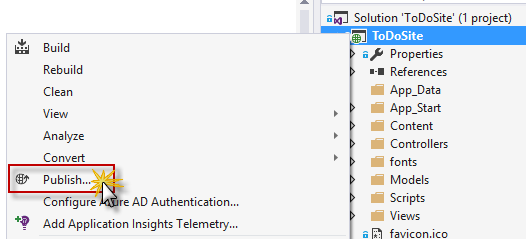
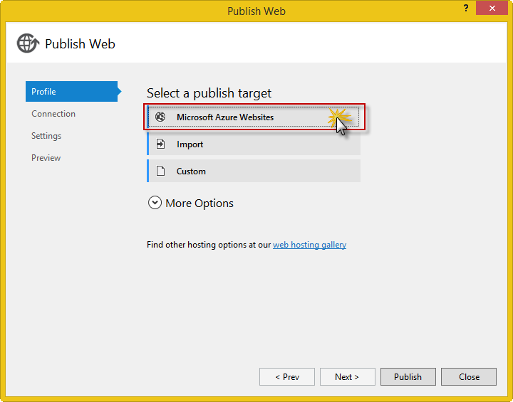
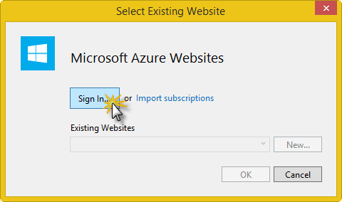
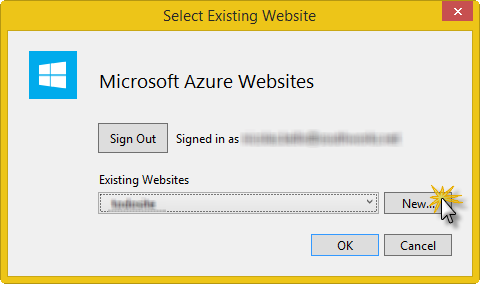
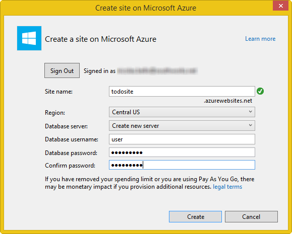
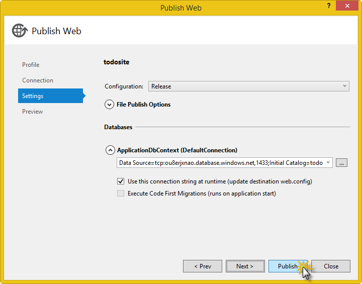

Building a hosted app
===============================

In this lab you will learn how to write a hosted application for an existing website using the WebView control and the [Web Application Template](https://wat-docs.azurewebsites.net/) (WAT). Additionally, you will see how to add a native feature to the app created with the WAT template and how to add support for offline detection and SuperCache. 

This lab includes instructions for:

1. [Setting up a website](#WebsiteSetup)
1. [Building a Hosted app using the WebView Control](#BuildHostedAppWebView)
1. [Building a Hosted app using WAT](#BuildHosteAppWAT)
1. [Adding offline functionality to hosted app](#HostedAppOffline)

<a name="WebsiteSetup" />
##Setting up a website
To be able to execute the instructions in the upcoming sections you will need a running website. 

The website that will be used in this lab is a simple To Do List website that supports user registration and login, and maintains a list for each user. The user logged in can add and delete To Do items consisting of a description, and toggle their completed status. 

To setup the website deploying it to Microsoft Azure follow these steps: 

1. Start Visual Studio and open the **ToDoSite** solution in the [website](website) folder of this repository.

1. Right-click on the **ToDoSite** project and select **Publish...**.

	

	_Publish the website_

1. In the **Publish Web** window, select **Microsoft Azure Websites** as publish target.

	

	_Select Microsoft Azure Websites_

1. If you haven't already signed in to Azure, click **Sign In** and enter your credentials.

	

    _Sign in to Azure_

1. Once signed in, create a new website by clicking **New...** 

	

    _Create a new website_

1. Choose a unique name for your site name like _to-do-site-01_ and select a region near you. You can use [azurespeed.com](http://www.azurespeed.com/ "AzureSpeed.com") to find the lowest latency data center.

1. If you haven't created a database server before, select **Create new server**. Enter a database username and password and click **Create**.

	

    _Configure Azure Website_

	If you have a database server, use that to create a new database. Database servers are a precious resource, and you generally want to create multiple databases on the same server for testing and development rather than creating a database server per database. Make sure your web site and database are in the same region.

1. Click **OK**.

1. In the **Connection** tab of the **Publish Web** wizard, click **Publish**.

	

    _Publish the site to Azure_

	Visual Studio begins the process of copying the files to the Azure server.

	Upon successful deployment, the default browser automatically opens to the URL of the deployed website, and the application that you created is now running in the cloud. The URL in the browser address bar shows that the site is being loaded from the Internet.

	The website will open in a new tab in Internet Explorer.

1. Take note of the URL of the website, as we will use it in the remaining tasks of this lab whenever **%WebsiteURL%** is mentioned. It should have the form: **http://your-site-name.azurewebsites.net**.

	

	_Take note of the url of the site_

1. Click **Register as a new user** in the **Login Page**. 
	
	When the **Register** page is displayed, enter values in all fields and click **Register**.

	_Note: the email address does not need to exist, as it will be used as a local identifier._

	

	_Register a new account_

1. Close the browser.

Keep the site running while executing all sections of this lab.

<a name="BuildHostedAppWebView" />
##Building a hosted app using the WebView Control
The WebView control hosts HTML content in an application and allows navigation to a URL. You can find more information about the properties, methods and events it provides [here](http://msdn.microsoft.com/en-us/library/windows/apps/dn301831.aspx).
In this section we will show you how to build a hosted app that uses a WebView control to display the existing website, and how to add an event handler to it. 

1. Start Visual Studio and create a **new JavaScript Blank app** (**Universal Apps**) project named _HostedToDo_.

	

	_Create new Blank JavaScript project_

	The new project will include:
	* One Windows Store app project, named _HostedToDo.Windows_.
	* One Windows Phone Store app project, named _HostedToDo.WindowsPhone_. 
	* One _HostedToDo.Shared_ folder to store shared code. By default, all JavaScript files for the project are shared. HTML and CSS files can also be shared.

1. Open **default.html** in the **HostedToDo.Windows** project and replace the content of the body element with the following content. Replace the variable **%WebsiteURL%** with the value obtained while setting up the website in the setup section of this lab.

	<!-- mark:2-3 -->
	````HTML
	<body>
		 <x-ms-webview id="webview" src="%WebsiteURL%">
		 </x-ms-webview>
	</body>
	````

1. Open **default.css** in the **css** folder of the **HostedToDo.Windows** project and add the following CSS rules:

	````CSS
	#webview {
		 width: 100%;
		 height: 100%;
	}
	````

1. Verify that the **HostedToDo.Windows** project is set as startup project (project name should show **in bold**) and that the debug mode is set to **Simulator** in the toolbar.

1. Press **F5** to build and debug the application. 

	Verify that the app launches in the Simulator.	The Simulator will first display a splash screen like the one below and then the Login page of the website. After logging in with the user created in the setup steps, you should be able to view your existing To Do items (if any), add new To Do items and mark them as completed.

	

	_HostedToDo splash screen_

	

	_HostedToDo Login Page_

	

	_HostedToDo Main View_

	As you have noticed, the splash screen displays an empty image. To fix this, as well as other branding issues, edit the **package.appxmanifest** file as explained in the [Native App lab](../native-app). The images that you can use can be found in the [Windows images folder](EndSolutionHostedApp/HostedToDo/HostedToDo/HostedToDo.Windows/images) of the end solution for this lab.
	Then you can press **Ctrl+Shift+F5** or hit the **Restart** button in the toolbar to relaunch the app with the changes just made applied.

1. Stop debugging.

	As we did for the Windows project, we will customize and debug the Windows Phone application on an emulator.

1. Open **default.html** in the **HostedToDo.Windows.Phone** project and replace the body element with the following content. Again, replace **%WebsiteURL%** with the value obtained while setting up the website in the setup section of this lab.

	<!-- mark:2-3 -->
	````HTML
	<body class="phone">
		 <x-ms-webview id="webview" src="%WebsiteURL%">
		 </x-ms-webview>
	</body>
	````

1. Open **default.css** in the **css** folder of the  **HostedToDo.Windows.Phone** project and insert the following CSS rules:

	````CSS
	#webview {
		 width: 100%;
		 height: 100%;
	}
	````
	
	As before, follow the instructions in the [Native App lab](../native-app) to edit the **package.appxmanifest** in the **HostedToDo.Windows.Phone** project and update the images, background color and other properties there. The images that you can use can be found in the [WindowsPhone images folder](EndSolutionHostedApp/HostedToDo/HostedToDo/HostedToDo.WindowsPhone/images) of the end solution for this lab.

1. Set the **HostedToDo.WindowsPhone** project as startup project and select a Windows Phone emulator from the toolbar. 

1. Press **F5** to build and debug the application. 

	The selected Windows Phone Emulator will launch. Once the app launches, it will first display the splash screen and then the Login Page for the To Do app. As before, after logging in with the user created in the setup steps, you should be able to view your existing To Do items (if any), add new To Do items and mark them as completed.

	

	_Hosted To Do splash screen on Windows Phone Emulator_

	

	_HostedToDo application in Windows Phone_

1. Switch back to Visual Studio and stop debugging. 

	Now you will add an event listener to the WebView control, so that when it finishes loading it displays a welcome message to the user. You will need to add a new JavaScript file for the code and new elements for the message to the html page.

1. Right-click the **js** folder in the **HostedToDo.Shared** project and add a new JavaScript file named **eventhandlers.js**. Copy and paste the code from [HostedToDo.Shared/js/eventhandlers.js](EndSolutionHostedApp/HostedToDo/HostedToDo/HostedToDo.Shared/js/eventhandlers.js) (or from the code snippet below) into your newly created file.

	````JavaScript
	var webView = document.getElementById("webview");
	// when navigation is complete, display the welcome message
	webView.addEventListener("MSWebViewNavigationCompleted", function (e) {
		 console.log("navigation complete");

		 var welcomeMsg = document.querySelector(".welcome-message");

		 if (welcomeMsg && !localStorage["welcome-message"]) {
			  welcomeMsg.style.display = "block";

			  var overlayClose = document.querySelector('#close');
			  if (overlayClose) {
					overlayClose.addEventListener("click", function () {
						 welcomeMsg.style.display = "none";
						 localStorage["welcome-message"] = true;
					});
			  }
		 }
	});
	````
	
	The code above defines and registers an anonymous function as an event handler for the **MSWebViewNavigationCompleted** event of the webView. This function, called when the WebView control finishes navigating to each page, is responsible for showing the welcome message if it has not been shown before. The function also registers an event handler for the **click** event of the _close_ button displayed as a red x in the welcome message. This event handler also saves to local storage that you have seen the welcome message, so next time it won't be displayed.

	There is also a call to _console.log_. You will learn where to view this message when debugging the application in the next steps.

	Other events for which handlers could be registered are:

	* MSVwebViewNavigationStart
	* MSVwebViewContentLoading
	* MSVwebViewDOMContentLoaded

	You can find the complete list of events and more information [here](http://msdn.microsoft.com/en-us/library/windows/apps/dn301831.aspx#events).

1. Open **default.html** in the **HostedToDo.Windows** project and update the _body_ element, so it looks like below. Again, replace **%WebsiteURL%** with the value obtained while setting up the website in the setup section of this lab.

	````HTML
	<body>
		 <div class="welcome-message">
			  <div id="welcome">
					<span id="close">x</span>
					<div class="message">
						 <h2>Welcome to the To Do application!</h2>
						 <div class="features">
							  <p>Add new tasks to your list, just type a description and click Add.</p>
							  <p>Delete tasks by clicking the red <span style="color:red">x</span> next to it.</p>
							  <p>Toggle the completion status of a task by checking/unchecking the checkbox.</p>
						 </div>
						 <p>Thanks for using To Do!</p> 
					</div>
			  </div>
		 </div>
		 <x-ms-webview id="webview" src="%WebsiteURL%">
		 </x-ms-webview>
		 <script src="/js/eventhandlers.js"></script>
	</body>
	````

	With these updates you have added the elements that make up the welcome message and included the **eventhandlers.js** file that was added as well, at the bottom of the file. Now you will add some styles required for the welcome message.

1. Open **default.css** in the **css** folder of the **HostedToDo.Windows** project and add the following rules after the existing ones:

	````CSS
	.welcome-message {
		 position: absolute;
		 width: 50%;
		 height: 40%;
		 top: 30%;
		 left: 20%;
		 z-index: 1000;
		 font-size: 20px;
		 font-weight: bold;
		 background: rgba(0, 0, 0, 0.9);
		 border: 4px solid #CCC;
		 display: none;
		 padding: 40px;
	}

	.features {
		 list-style: none;
		 text-align: left;
		 font-weight: bold;
	}
	.message {
		 text-align: center;
		 color: #EEE;
		 vertical-align: middle;
	}

	#close {
		 float: right;
		 color: red;
		 text-align:center;
		 border: 1px solid #CCC;
		 width: 34px;
		 height: 34px;
	}

	@media all and (max-width : 800px) {
		 .welcome-message {
			  left:0;
			  right:0;
			  top: 30%;
			  width: auto;
			  height: 40%;
		 }
	}
	````

1. Set the **HostedToDo.Windows** project as startup project. 

1. Press **F5** to start debugging.
	
	The app will launch in the Simulator. After the splash screen disappears you should see a welcome message like the one below, displaying instructions on how to use the app. This welcome message can be dismissed by clicking the red x at the top right of the message.

	

	_Welcome message displayed when the application finishes loading the content_

1. Switch to Visual Studio while debugging, and find the **JavaScript Console** window. If not displayed, open it by clicking **Debug > Windows > JavaScript Console**.

	
	_JavaScript Console window_

	The **JavaScript Console** window displays messages sent to the console by the application, and allows you to interact with any application objects in scope. As you saw before, the code contained a call to the console.log method. You can see that the message was printed. You could add other messages or log the value of objects at the time they are in scope. This is one way of verifying your app behaves as expected.

	You can find more information about the **JavaScript Console** window and the console object [here](http://msdn.microsoft.com/en-us/library/windows/apps/hh696634.aspx).

1. Stop debugging.

	You will now make the same changes to the Windows Phone app. 

1. Open **default.html** in the **HostedToDo.WindowsPhone** project and update the _body_ element, so it looks like below. Again, replace **%WebsiteURL%** with the value obtained while setting up the website in the setup section of this lab.

	````HTML
	<body class="phone">
		 <div class="welcome-message">
			  <div id="welcome">
					<span id="close">x</span>
					<div class="message">
						 <h2>Welcome to the To Do application!</h2>
						 <div class="features">
							  <p>Add new tasks to your list, just type a description and click Add.</p>
							  <p>Delete tasks by clicking the red <span style="color:red">x</span> next to it.</p>
							  <p>Toggle the completion status of a task by checking/unchecking the checkbox.</p>
						 </div>
						 <p>Thanks for using To Do!</p>
					</div>
			  </div>
		 </div>
		 <x-ms-webview id="webview" src="%WebsiteURL%">
		 </x-ms-webview>
		 <script src="/js/eventhandlers.js"></script>
	</body>
	````

1. Open **default.css** in the **css** folder of the **HostedToDo.WindowsPhone** project and add the following rules after the existing ones:

	````CSS
	.welcome-message {
		 position: absolute;
		 width: auto;
		 height: 60%;
		 top: 20%;
		 left:0;
		 right:0;
		 z-index: 1000;
		 font-size: 20px;
		 font-weight: bold;
		 background: rgba(0, 0, 0, 0.9);
		 border: 4px solid #CCC;
		 display: none;
		 padding: 40px;
	}

	.features {
		 list-style: none;
		 text-align: left;
		 font-weight: bold;
	}
	.message {
		 text-align: center;
		 color: #EEE;
		 vertical-align: middle;
	}

	#close {
		 float: right;
		 color: red;
		 text-align:center;
		 border: 1px solid #CCC;
		 width: 34px;
		 height: 34px;
	}
	````

1. Set the **HostedToDo.WindowsProject** project as startup project. 

1. Press **F5** to start debugging.

	The app will launch in the emulator. As it happens for the Windows app, after the splash screen disappears you should see the welcome message and dismiss it by clicking the red x at the top right.

	

	_Welcome message displayed in Windows Phone app_

As you have seen, creating an application that uses a WebView control makes it quite easy to host web-based content in an application. Some advantages of using the WebView control are:

- Support for most HTML5 functionality,
- Improved navigation support, as the control has its own separate history that is navigable,
- Support for sites that don't work inside frame o iframe elements.

However, you will need to manually implement other features common to Windows or Windows Phone applications, like:

- navigating back when the back button is hit,
- displaying an appbar or navigation bar,
- detecting when the device is offline and displaying a message.

In the next section you will build an app using the Universal Template, which already contains code to handle those features by enabling the configuration options in a config file. 

<a name="BuildHosteAppWAT" />
##Building a hosted app using WAT
The Web App Template for Universal Apps (WAT) is a Visual Studio 2013 template that lets developers create Windows and Windows Phone apps based on existing web content. You can find more information about it [here](http://wat-docs.azurewebsites.net/).
In this section you will learn how to build a hosted app for the website set up in the first section using the WAT and how to configure it to take advantage of other features that it provides out of the box. 

1. Start Visual Studio and create a **new JavaScript Web App Template for Universal Apps** project named _WatToDo_.

	

	_Create new JavaScript project using the WAT template_


	> _Note:_ Alternatively, you can open the **WatToDo** solution in the [BeginSolutionWatApp/WatToDo](BeginSolutionWatApp/WatToDo) folder of this repository.

	The solution includes:
	* a WatToDo folder containing: 
		* One Windows Store app project, named _WatToDo (Windows 8.1)_ 
		* One Windows Phone app named _WatToDo.WindowsPhone_,
		* One _WatToDo.Shared_ project to hold shared code,
	* a C# project named HtmlAgilityPack
	* a C# project named WatExtensions.

	The **Readme.html** file, located in the **WatToDo.Shared** project, contains brief information on the latest changes in this version of the template as well as information on the minimum configuration for the app. 

	The **config.json** file, located in the **config** folder in the **WatToDo.Shared** project, holds all the application configuration.

1. Click the **config.json** tab and update the value of the following variables:

	* **"start_url"**: set it to **%WebsiteURL%** (as obtained in the setup section)
	* **"name"**: set it to _To Do_

	You will learn about the **wat_customScript** and **wat_styles** section in upcoming steps in this lab. For now, do not make any changes to them.

	Save the file. It should end up looking like this:

	<!-- mark:3-4 -->
	````JavaScript
	{
		 "$schema": "/schema/schema-manifest.json",
		 "start_url": "%WebsiteURL%",
		 "name" :  "To Do",

		 "wat_customScript": {
			  "scriptFiles._comment": "An array of custom script files stored within the app package that are injected into the DOM",
			  "scriptFiles": [
					"injection-script-example.js"
			  ]
		 },

		 "wat_styles": {
			  "customCssFile._comment": "This enables you to embed CSS styles which get inserted over the existing styles on your website. This is great for adjusting the style of the site when it is presented as an application. This can be used as an alterntive to the injected-styles.css.",
			  "customCssFile": "/css/injected-styles.css"
		 }
	}
	````

	With just these changes you have an app that is roughly equivalent to the one built in the previous section. What is needed for a truly equivalent app is to set the logos, branding and other properties in the app manifest for both projects, as explained in the Native App lab. The images that you can use can be found in the [Windows images folder](EndSolutionWatApp/WatToDo/WatToDo/WatToDo/images) and [Windows Phone images folder](EndSolutionWatApp/WatToDo/WatToDo/WatToDo.WindowsPhone/images) of the end solution for this lab.

1. Set the **WatToDo.Windows** project as startup project, and then the debug mode is set to **Simulator**.

1. Press **F5** to build and debug the application. 
	Verify that the app launches in the Simulator. If you have set the images and background color in the app manifest, the Simulator will display a splash screen and then the Login Page for the To Do app. After logging in with the user created in the setup steps, you should be able to view your existing To Do items (if any), add new To Do items and mark them as completed.

	

	_WatToDo main view_

	You may notice that the footer of the page is visible. You will learn how to hide it in upcoming steps, so the app looks more like an app and less like a website.

1. Switch back to Visual Studio and stop debugging.

1. Set the **WatToDo.WindowsPhone** project as startup project and select a Windows Phone emulator.

1. Press **F5** to build and debug the application. 
	The selected WindowsPhone Emulator will launch. 
	Once the app launches, it will first display a splash screen and then the Login Page for the To Do app. Login in to see the list of To Do items and use other functionality.

	

	_Wat To Do splash screen on Windows Phone Emulator_

	

	_WatToDo application in Windows Phone_

1. Switch back to Visual Studio and stop debugging. 

	You will now see how to configure your application so the footer of the website is not displayed.

1. Open the **config.json** file and find the **"wat_styles"** section. 

	This section allows the configuration of the application's view of the website. The full list of configuration options for this section can be found [here](https://wat-docs.azurewebsites.net/JsonWindows#styles).

	The current settings reference the _/css/injected-styles.css_ file, where additional styles to be injected into the WebView control in which the website is displayed are defined. The file is in the **WatToDo.Shared** project, and by default it is empty. You will add content to this file later, when adding a native feature to the app.
	
	In the next step you will configure **hiddenElements** in the **wat_styles** to hide the website footer. The **hiddenElements** is an array of strings, each a CSS locator to an HTML element to be hidden. 

1. Update the **"wat_styles"** section so it looks like this:
	<!-- mark:2-4 -->
	````JavaScript
	 "wat_styles": {
		  "hiddenElements": [
				"footer"
		  ],
		  "customCssFile._comment": "This enables you to embed CSS styles which get inserted over the existing styles on your website. This is great for adjusting the style of the site when it is presented as an application. This can be used as an alterntive to the injected-styles.css.",
		  "customCssFile": "/css/injected-styles.css"
	 },

	````

1. Set the **WatToDo.Windows** project as the startup project and then press **F5**.

	Once the application launches and the Login Page is visible, the website footer should no longer be visible. 

	

	_WatToDo app after hiding the footer_

1. Switch back to Visual Studio and stop debugging.

	###Adding a native feature to the app

	Now you will learn how to add a new feature to the app that makes use of native device capabilities, like getting a scheduled notifications for a To Do item. 

	This feature is intended to behave as follows: each To Do item will have a button that allows the user to set a reminder. Once the user sets a reminder, a native notification will be scheduled to go off in a second. The user will be able to see it in the Action Center. 

	To accomplish this, you will:

	* add javascript code to add an _Add reminder_ button for each task. This button will have an event listener so that, when clicked, a message will be sent to the native app. This code will be injected into the WebView control and run within the website. 
	* add javascript code that runs in the app and schedules the notification when the reminder is added.
	* add style rules for the _Add reminder_ button, that will be injected into the website page.

1. Right-click the **WatToDo.Shared** project and add a new folder named **js**.

1. Right-click the **js** folder and add a new JavaScript file named **reminder.js**. Copy and paste the code in the code snippet below into your newly created file (or copy it from [WatToDo.Shared/js/reminder.js](EndSolutionWatApp/WatToDo/WatToDo/WatToDo.Shared/js/reminder.js)).

	This code is the one that schedules the notifications.

	````JavaScript
	(function (WAT) {
		 "use strict";

		 var logger;

		 // Public API
		 var self = {
			  start: function () {
					if (WAT.getModule("log")) {
						 logger = WAT.getModule("log");
					}

					WAT.options.webView.addEventListener("MSWebViewScriptNotify", function (e) {
						 var toDoTitle = getTitleParameter(e, "ADD-REMINDER");
						 if (!toDoTitle) {
							  // oops, this isn't ours
							  return;
						 }

						 logger.log("Adding reminder for: ", toDoTitle);

						 scheduleToast(toDoTitle)
					});
			  },
		 };

		 // Private functions
		 function scheduleToast(taskDescription) {
			  logger.log("scheduleToast");
			  // Scheduled toasts use the same toast templates as all other kinds of toasts.
			  var template = Windows.UI.Notifications.ToastTemplateType.toastText02;
			  var toastXml = Windows.UI.Notifications.ToastNotificationManager.getTemplateContent(template);

			  var toastTextElements = toastXml.getElementsByTagName("text");
			  toastTextElements[0].appendChild(toastXml.createTextNode("To Do: " + taskDescription));

			  var currentTime = new Date();
			  var startTime = new Date(currentTime.getTime() + 1000);
			  var scheduledToast = new Windows.UI.Notifications.ScheduledToastNotification(toastXml, startTime);

			  Windows.UI.Notifications.ToastNotificationManager.createToastNotifier().addToSchedule(scheduledToast);
			  logger.log("Scheduled a toast for task: " + taskDescription);
		 };

		 function getTitleParameter(e, parameter) {
			  if (e.type === "MSWebViewScriptNotify") {
					var content = e.value.split(/~~/);
					if (content.length === 2 && content[0] === parameter) {
						 return content[1];
					}
			  }
			  
			  return null;
		 };

		 // Module Registration
		 WAT.registerModule("reminder", self);

	})(window.WAT);
	````

	The above code uses an event listener that targets the _MSWebViewScriptNotify_ event of the WebView control. This event is triggered by calling _windows.external.notify_ from within the site that is loaded inside the WebView control.

1. Open **injection-script-example.js** in the **WatToDo.Shared** project. Replace the default content of the file with the code in [WatToDo.Shared/injection-script-example.js](EndSolutionWatApp/WatToDo/WatToDo/WatToDo.Shared/injection-script-example.js).

	This code will be injected by the app into the website displayed in the WebView control.

	````JavaScript
	(function () {
		 // This script will be executed in the context of the webview
		 function addReminderToTasks() {
			  console.log("addReminderToTasks");
			  if (document.getElementById("todo-view")) {
					//We are in the To Do Main page
					var toDoItems = document.querySelectorAll("#todo-view #main div.todo-item");
					for (var i = 0; i < toDoItems.length; i++) {
						 var textElement = toDoItems[i].getElementsByTagName("span")[0];
						 if (textElement) {
							  var toDoScope = angular.element(textElement).scope();
							  if (toDoScope && toDoScope.todo && toDoScope.todo) {
									var toDoTitle = toDoScope.todo.Title;

									if (toDoItems[i].getElementsByClassName('reminder').length === 0) {
										 var reminder = document.createElement("button");
										 reminder.setAttribute("class", "reminder");
										 reminder.appendChild(document.createTextNode("Add Reminder"));
										 reminder.addEventListener("click", function () {
											  window.external.notify('ADD-REMINDER~~' + toDoTitle);
										 });
										 toDoItems[i].appendChild(reminder);
									}
							  }
						 }
					};
			  }
		 }

		 var toDoCtrlCtrlScope = angular.element('#todoapp').scope();

		 toDoCtrlCtrlScope.$watchCollection('todos', function () {
			  addReminderToTasks();
		 });

		 addReminderToTasks();
	})();
	````

	This code will add a new button element to each todo item whenever the todo collection is updated. Note that whenever the button is clicked the _windows.external.notify_ function will be called.

1. Open **wat-wrapper.html** in the **template** folder of the **WatToDo.Windows** project and update it to add the line below in the _head_ element just after all other script includes, so the **reminder.js** file just added is included when the app loads.

	````HTML
	<script src="/js/reminder.js"></script>
	````

	As a final step, we will enable the app for the Toast notifications capability.

1. Double-click the **package.appxmanifest** file in the **WatToDo.Windows** project. In the **Application** tab, select **Yes** in the **Toast capable** dropdown.

	

	_Set app as Toast Capable_

1. Switch to the **Content URIs** tab and update the _https://wat-docs.azurewebsites.net_ with the url of your site. Note that you need to use the _https_ endpoint.

	
	
	_Set your site url as content uri_

1. Make sure the **WatToDo.Windows** project is set as the startup project, and set the debug mode to **Local Machine**. 

	> **Note:** When testing toast notification code functionality through Microsoft Visual Studio, you must use either the Local Machine or Remote Machine debug setting on a Windows x86, x64, or Windows Runtime machine. You cannot use the Visual Studio Simulator debug function option, as the code will compile and run in the Simulator, but the toast will not appear.

	

	_Set Debug to Local Machine for the WatToDo.Windows project_

1. Press **F5** to build and debug the application.

	The app will launch in your local machine. You will see the splashscreen and the the Login Page. Once you log in and the To Do main view appears, you will see that each To Do item in the list has a button to set a reminder. 

	

	_WatToDo app with native feature_

1. Click the _Add reminder_ button to set a reminder for a To Do item.

	

	_Notification for To Do item is received_

	You can change the way the reminder button looks, as well as other items in the website, by updating their styles in the injected-styles.css file. Any styles in this file are injected by the app into the website displayed in the WebView control.

1. Open **injected-styles.css** in the **css** folder of the **WatToDo.Shared** project and add the following css rules:

	````CSS
	.reminder {
		 margin: 5px;
		 border: gray 1px solid;
		 float: right;
	}

	.todo-item {
		 height: 35px;
	}

	button.destroy {
		 float: right;
	}
	````

	With these rules you are changing the location of the _Add reminder_ and the _x_ shown to delete items so that they are aligned to the right, and changing the height of each To Do item. While some of these changes can be made directly to the website, you may want to only apply them to differentiate the app from the website. Also, the _Add reminder_ button was added to the app (not to the site) so the styles for that need to be added here.


1. Press **Ctrl+Shift+F5** to restart the app.

	Once the app launches again in the Simulator you will notice the styling has changed, matching the new styles just defined.

	

	_WatToDo app with injected styles_

1. Switch back to Visual Studio and stop debugging.

	You can make the same changes made to the **WatToDo.Windows** project to the **WatToDo.WindowsPhone** project, set it as the startup project and debug the app, to verify that the changes made in the latest steps are indeed working just like in Windows.

	

	_WatToDo app running in Windows Phone with reminders_

	As you have seen, creating a Windows and Windows Phone 8.1 app using the WAT template is simple, and many useful features can be added just by changing a configuration in the config.json file. The full list of configuration options can be found [here](https://wat-docs.azurewebsites.net/JsonWindows). 
	
	You have also learned that it is possible to add a native feature, integrating device capabilities into an app that is displaying content from a website.

<a name="HostedAppOffline" />
##Adding offline functionality to hosted app

As you have learned so far, the Web Application Template (WAT) facilitates the creation of Windows apps based on existing web content, rendered via a WebView control. When the network is down, the WebView is unable to get data and the user would see an error. 

In this section you will learn how to configure your application to handle being offline. The template provides offline support in two ways, of different complexity, both of which include automatic detection of being offline: 

* falling back to a "offline content" in the form of a simple page with a message when the app detects it is offline,
* enabling SuperCache, a cache in which all pages through which the user navigates when online are stored, to be retrieved when the app detects it is offline.

Both are configured in the **wat-offline** section in the **config.json** file. More information about it can be found [here](https://wat-docs.azurewebsites.net/JsonWindows#offline).

### Offline support via an offline page
By default, offline mode support is disabled in the application. In this section you will learn how to enable offline mode support in the application and how to configure the offline page so that its content is adapted to the same style that your application has.

1. Open the **config.json** file and update it to add the **"wat_offline"** section as shown in the following code snippet: 

	<!-- mark:1-5 -->
	````JavaScript
    "wat_offline": {
        "enabled": true,
        "message": "It looks like you are offline. Once network connection is restablished, you will be able to use the To Do application again."
    }
	````

	With these settings you are enabling the offline mode and customizing the message displayed to the user. If the message is not provided, the default message will be displayed.

1. Press **F5** to debug the application.

	The app will launch in the Simulator.

1. Disconnect your computer from the network.

	After a few seconds the app will detect that it is offline and display the offline message configured.

	

	_Offline message_

1. Restablish the network connection.

	After a few seconds the app will detect that it is online again and navigate back to the To Do Main page.

	As you can see, the default message does not follow the same style of the website. You will now customize the offline page so that it does.

1. Switch back to Visual Studio and open **offline.html** in the **template** folder of the **WatToDo.Shared** project. Copy and paste the content from [WatToDo.Shared/template/offline.html](EndSolutionWatApp/WatToDo/WatToDo/WatToDo.Shared/template/offline.html)) or from the code snippet below into the file, replacing the existing code.
	
	````HTML
	<!DOCTYPE html>
	<html>
	<head>
		 <title>Network connection lost!</title>
		 <meta name="viewport" content="width=device-width, initial-scale=1, user-scalable=no">
		 <style>
			  body {
					-ms-touch-action: none !important;
					font-family: Helvetica, Arial, sans-serif;
					text-align: center;
					background-color: #000000;
					color: #FFFFFF;
			  }

			  h1 {
					font-size: 24px;
					font-weight: bold;
			  }

			  p.subtitle {
					font-weight: 300;
					line-height: 1.5;
					font-size: 14px;
			  }

			  img {
					width: 80%;
					height: 80%;
			  }
		 </style>
	</head>
	<body>
		 
		 <h1>You are offline!</h1>

		 <p class="subtitle">Please try again later once network connectivity is restablished.</p>
	</body>
	</html>
	````

1. Right-click the **WatToDo.Shared** project and add a new folder named **images**.

1. Right-click the **images** folder just added and add the [offlinelogo.png](EndSolutionWatApp/WatToDo/WatToDo/WatToDo.Shared/images/offlinelogo.png) image.

1. Press **Ctrl+Shift+F5** to restart the application.

	The app will launch again in the Simulator.

1. Disconnect your computer from the network.

	After a few seconds the app will detect that it is offline and display the offline page that you have just updated.

	
	
	_Custom Offline page_

1. Restablish the network connection.

	As before, a few seconds after you restablish the network connection the app will detect it and display back the To Do Main page.

1. Switch back to Visual Studio and stop debugging.


###Configure app to use SuperCache
As you saw in the previous section, basic offline support via an offline page is easily attainable. However, you might want to provide the user with a better experience when network connectivity is down, so that the app behaves more like a native app. In this section you will learn how to enable SuperCache, a module in the WAT template that saves each page visited while online into a local cache so they can be reused when the network is down.

1. Open the **config.json** file and update the **"wat_offline"** section to enable SuperCache, as shown in the following code snippet: 
	<!-- mark:4-6 -->
	````JavaScript
    "wat_offline": {
        "enabled": true,
        "message": "It looks like you are offline. Once network connection is restablished, you will be able to use the To Do application again.",
        "superCache": { 
            "enabled": true
        }
    }

	````

	With the addition of the SuperCache **enabled** setting set to true you are enabling the SuperCache engine. 

1. Press **F5** to debug the application.

	The app will launch in the Simulator.

1. Disconnect your computer from the network.

	After a few seconds the app will detect that it is offline and display an offline message at the top of the page, indicating the app is offline and functionality might be degraded until the app is back online. This message can be dismissed by clicking the x at the right, or it can stay and will disappear on its own after network connectivity is restablished.

	

	_WatToDo app in Offline mode, with SuperCache message_

1. Restablish the network connection.

	If you did not dismiss it, the yellow offline message will dissapear.

	Notice that by simply enabling SuperCache the app continues to display the last page the user was viewing (in this case the only page in the app). This is an improvement from the previous behavior of displaying an offline page, as the user can continue viewing its tasks. However, as soon as the user wants to perform an action like marking a To Do item as complete, the app will navigate to the Offline page as this action requires being online to save the status. If this is not the desired behavior, it is possible to configure the app to hide elements when the app is in offline mode just like you did when configuring it not to show the footer. 

1. Switch to Visual Studio and stop debugging.

1. Open the **config.json** file and find the **"wat_styles"** section. 
	
1. Update the **"wat_styles"** section so it looks like this:

	````JavaScript
    "wat_styles": {
        "hiddenElements": [
            "footer",
            ".wat_offlinemode .todo-item .toggle",
            ".wat_offlinemode .destroy",
            ".wat_offlinemode .reminder",
            ".wat_offlinemode .header-content",
            ".wat_offlinemode .navbar-right li:last-child"
        ],
        "customCssFile._comment": "This enables you to embed CSS styles which get inserted over the existing styles on your website. This is great for adjusting the style of the site when it is presented as an application. This can be used as an alterntive to the injected-styles.css.",
        "customCssFile": "/css/injected-styles.css"
    },

	````

	The CSS selectors added to hiddenElements are targeting the status checkbox, the add reminder and delete buttons for the To Do items, the new To Do item elements and the Signoff button, with the class **wat_offlinemode** added. By adding these selectors to the hiddenElements array a new CSS rule with all the selectors is injected to the website when its loaded, setting the _display_ attribute to _none_. When the app goes offline and SuperCache detects it, the style **wat_offlinemode** is and added to the _body_ element of the website. The opposite happens when the apps goes back online. Thus, any element added to the hiddenElements list prefixed by **.wat_offlinemode** will be hidden or visible automatically as the app goes offline or online.

1. Press **F5** to debug the application.

	The app will launch in the Simulator. Login.

1. Disconnect your computer from the network.

	After a few seconds the app will detect that it is offline and display the yellow offline message at the top of the page. This time, it will also hide the elements mentioned above.

	

	_WatToDo app in offline mode with hidden elements_

1. Restablish the network connection.

	If you did not dismiss it, the yellow offline message will dissapear. Also, the hidden elements will be visible again.

1. Switch to Visual Studio and stop debugging.
	You can read about other ways to customize SuperCache via settings in the config.json [here](https://wat-docs.azurewebsites.net/JsonWindows#offline).

> **Note:** All the previous steps, including enabling supercache and the simple offline page, should work in Windows Phone too.


###Summary

In this lab you have learned how to write a hosted application for an existing website using the WebView control and the Visual Studio Web Application Template(WAT). You have also learned how to add a native feature to the app, and how to add offline support to the app using WAT features like the offline page and SuperCache.
